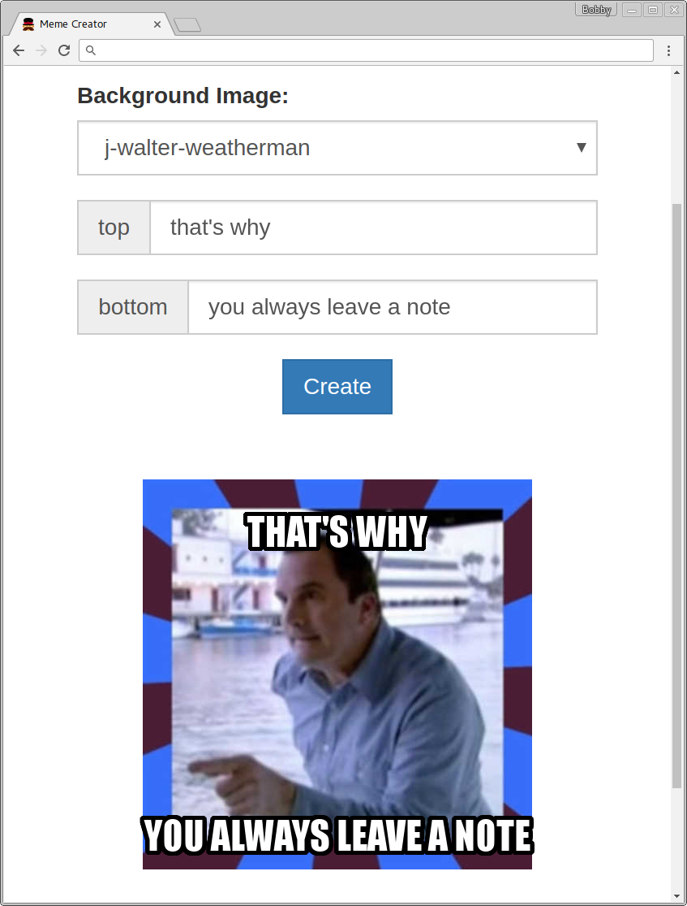

Browsix - Bringing Unix to the Browser
======================================

[](http://badge.fury.io/js/browsix)
[](https://david-dm.org/jvilk/browserfs#info=dependencies&view=table)
[](https://david-dm.org/plasma-umass/browsix#info=devDependencies&view=table)

While standard operating systems like Unix make it relatively simple
to build complex applications, web browsers lack the features that
make this possible.  This project is Browsix, a JavaScript-only
framework that brings the essence of Unix to the browser. Browsix
makes core Unix features available to web applications (including
pipes, processes, signals, sockets, and a shared file system) and
extends JavaScript runtimes for C, C++, Go, and Node.js programs so
they can run in a Unix-like environment within the browser. Browsix
also provides a POSIX-like shell that makes it easy to compose
applications together for parallel data processing via pipes.

*For more details, check out our [tech
report (PDF)](https://web.cs.umass.edu/publication/details.php?id=2414)*.


Another way to think about this is that modern web applications are
multi-process by nature - the client and some of the application logic
lives in the browser, and some of it lives in the cloud, often
implemented as
[microservices](https://en.wikipedia.org/wiki/Microservices).

Browsix lets you rethink the boundary between code executing in the
browser vs. server-side, while taking advantage of the multi-core
nature of modern computing devices.

Browsix enables you to compose the in-browser part of your web
applications out of processes.  Processes behave as you would expect
coming from [Unix](https://en.wikipedia.org/wiki/Unix): they run in
parallel with the main browser thread, can communicate over pipes,
sockets, or the filesystem, and can create subprocesses.  This process
model is implemented on top of existing browser APIs, like [web
workers](https://en.wikipedia.org/wiki/Web_worker), so it works in all
modern browsers.  Browsix applications can be served statically or
over a [CDN](https://en.wikipedia.org/wiki/Content_delivery_network).

### The Browsix Shell

As a proof of concept, we've implemented a POSIX-like shell on top of
Browsix, along with an implementation of a number of standard Unix
utilities (`cat`, `tee`, `echo`, `sha1sum`, and friends).  The
utilities are all standard node programs that will run directly under
node, or in the browser under Browsix.  Individual commands are
executed in their own workers, and piping works as expected:


Try it out here: [live demo!](https://unix.bpowers.net/)

### Meme creator

Browsix is useful for more than web terminals.  With Browsix, you can
run Go microservices directly in the browser!  As an example, we have
implemented a meme creator, that lets you create memes (sometimes
known as image macros) with (hopefully) humorous text on top of
several images.  We wrote this as a standard REST service in Go,
accepting the text and image type as parameters, and returning a PNG.
We used [our modified
GopherJS](https://github.com/bpowers/browsix-gopherjs) compiler to
compile the Go service (including all dependencies, such as the
TrueType font renderer and image manipulation libraries) to
JavaScript, and Browsix to run this JavaScript as a process in a
background Web Worker.  We then dynamically route requests to either
this in-browser server or a remote server depending on user agent and
network connectivity.

<div style="text-align:center"></div>

### Details

Browsix currently supports running node.js, Go, and C/C++ programs.
It supports Go with a [modified GopherJS
compiler](https://github.com/bpowers/browsix-gopherjs) (requires a
host [Go 1.6 install for
now](https://github.com/bpowers/browsix-gopherjs/issues/2)), and C/C++
with [modifications to
Emscripten](https://github.com/bpowers/emscripten/tree/_browsix).

### Browsix-SPEC

Browsix supports executing SPEC CPU2006 and SPEC CPU2017 benchmarks using Browsix-SPEC
interface. 

Using Browsix
-------------

There are two parts to Browsix: build tooling (the modified Go + C
compilers) and runtime support (the kernel + Browsix APIs).

Get browsix through npm:

```
    $ npm install --save browsix
```


Building & Testing
------------------

Browsix requires **nodejs 4.3.0** or later, which is more recent than
the version packaged in Ubuntu Wiley.  To get a recent version of
node, follow the instructions on the [node.js
website](https://nodejs.org/en/download/package-manager/#debian-and-ubuntu-based-linux-distributions).
If you don't know whether you should choose node 4.x or 5.x, choose
4.x (it is the long-term support branch).

Browsix has three other dependencies: `git`, `npm` (usually installed
along with node), and `make`, and builds on OSX and Linux systems.
Once you have those dependencies:

```
    $ git clone --recursive https://github.com/plasma-umass/browsix
    $ cd browsix
    $ make test-once serve
```

This will pull the dependencies, build the runtime and all the
utilities, run a number of tests in either Firefox or Chrome, and then
launch a copy of the shell served locally.

`Dockerfile`
-----------

```sh
$ ./docker/build.sh
....
root@3695ed0cdf45:~/browsix# make test-once serve
  TEST
[13:07:00] Using gulpfile ~/browsix/gulpfile.js
[13:07:00] Starting 'copy-node-kernel'...
[13:07:00] Starting 'copy-node'...
[13:07:00] Starting 'lint-kernel'...
[13:07:00] Starting 'lint-browser-node'...
[13:07:00] Starting 'lint-bin'...
[13:07:00] Starting 'lint-syscall-api'...
[13:07:00] Finished 'copy-node-kernel' after 82 ms
[13:07:02] Finished 'lint-syscall-api' after 1.61 s
[13:07:04] Finished 'lint-kernel' after 3.72 s
[13:07:05] Finished 'lint-browser-node' after 4.46 s
[13:07:05] Finished 'lint-bin' after 5.08 s
[13:07:05] Starting 'build-bin'...
[13:07:06] Finished 'copy-node' after 5.16 s
[13:07:06] Starting 'build-kernel'...
[13:07:06] Starting 'build-browser-node'...
...
```

Building and using Browsix-SPEC
-------------------------------
After building Browsix, build Browsix-SPEC through make:
```
make browsix-spec
```
Follow the instructions in browsix-spec.md.

In-browser node limitations
---------------------------

Browsix's `browser-node` implementation has an important to understand
limitation: **you must explicitly call `process.exit()`**.  Without
this, utilities will work under real-node, but appear to hang under
`browser-node`.  This is not an intrinsic limitation, but it is a
hairy implementation detail -- node exits when the event loop is
empty, and there are no active timers or network callbacks.  For us to
do the same thing means we need to hook `setTimeout` and any other
functions that take callbacks to ensure we don't exit early.


Documentation
-------------

For a high-level overview of the system design and architecture,
please see [this document](doc/report.pdf).


Contributing
------------

You're interested in contributing?  That's great!

The process is similar to other open-source projects hosted on github:

* Fork the repository
* Make some changes
* Commit your changes with a descriptive commit message
* Open a pull request


Contact
-------

If you have questions or problems, please [open an
issue](https://github.com/plasma-umass/browsix/issues) on this
repository (plasma-umass/browsix).


Open Source
-----------

This project is licensed under the MIT license, but also incorporates
code from other sources.

Browsix uses [BrowserFS](https://github.com/jvilk/BrowserFS) for its
filesystem, which is [primarily MIT licensed](LICENSE.browserfs).

browser-node's [`nextTick`](src/browser-node/browser-node.ts#L114)
implementation comes from the
[acorn](https://github.com/ternjs/acorn) project, released under [the
MIT license](LICENSE.acorn).

A large portion of browser-node is the
[node](https://github.com/nodejs/node) standard library, which is [MIT
licensed](LICENSE.node).

Functions to convert buffers to utf-8 strings and back are derivative
of
[browserify](https://github.com/substack/node-browserify/blob/master/LICENSE)
implementations (ported to TypeScript), [MIT
licensed](LICENSE.browserify) as well.
